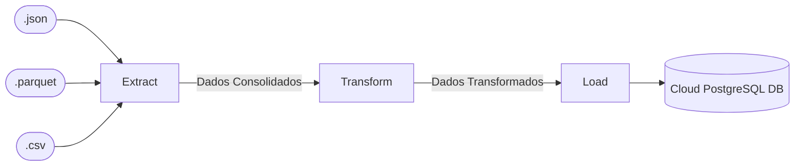

# Bem-vindo

Este projeto implementa uma pipeline de dados automatizada para extrair, transformar e carregar (*ETL*) dados de vendas fictícias de diversos formatos de arquivo para um banco de dados PostgreSQL na nuvem. A pipeline foi projetada para consolidar dados de múltiplas fontes em um único DataFrame, aplicar transformações específicas e armazená-los em um repositório central para facilitar a análise e a consulta.

## Objetivo do Projeto

A pipeline ETL realiza as seguintes operações principais:

1. **Extração (Extract)**: Extrai dados de arquivos `.csv`, `.json` e `.parquet` localizados em um diretório específico. Cada arquivo contém informações de vendas, como identificadores de pedidos, clientes, produtos, método de pagamento, quantidade e preço.

2. **Transformação (Transform)**: Processa os dados consolidados para calcular o valor total das vendas, agrupando-os por método de pagamento. Esse processo resulta em um resumo que permite uma análise mais fácil e rápida dos métodos de pagamento mais utilizados.

3. **Carga (Load)**: Insere os dados transformados em uma tabela chamada `sales_consolidated`, localizada em um banco de dados PostgreSQL hospedado na nuvem (Render). A tabela é recriada a cada execução, garantindo que os dados mais recentes estejam sempre disponíveis.

### Tecnologias Utilizadas

- **Python 3.12.5**: Versão definida e gerenciada com `pyenv`.
- **Poetry**: Gerenciamento de dependências e ambiente virtual.
- **Pandas**: Manipulação e processamento de dados.
- **Pandera**: Validação de esquema para garantir a integridade dos dados.
- **SQLAlchemy**: Interface para conexão com o banco de dados PostgreSQL.
- **Loguru**: Registro de logs de execução e de erro para facilitar o monitoramento e a depuração.
- **Render**: Plataforma de hospedagem do banco de dados PostgreSQL, com uma camada gratuita para até certo volume de dados.

## Pré-requisitos

Para executar este projeto, você precisará dos seguintes pré-requisitos:

- **Python 3.12.5**: Instale e gerencie essa versão com o `pyenv`.
- **Poetry**: Gerenciador de dependências e ambientes virtuais.
- **Banco de Dados PostgreSQL**: Um banco de dados PostgreSQL configurado na plataforma Render para armazenar os dados processados.

## Estrutura do Projeto

Aqui está uma visão geral da organização do projeto:

```plaintext
.
├── app/                 # Código principal da pipeline ETL
├── classes/             # Classes de suporte, incluindo a classe DataExtractor
├── data/                # Diretório para dados de entrada e saída
├── decorators/          # Decoradores para logs e medição de tempo de execução
├── documentation/       # Documentação do projeto (configurada para MkDocs)
├── funcs/               # Funções auxiliares
├── tests/               # Testes automatizados do projeto
├── .env                 # Arquivo de variáveis de ambiente (configuração do banco de dados)
├── .gitignore           # Arquivo para ignorar arquivos e diretórios no Git
├── .python-version      # Versão Python especificada para pyenv (3.12.5)
├── app.log              # Arquivo de log gerado pela execução do projeto
├── poetry.lock          # Arquivo de bloqueio de dependências gerado pelo Poetry
├── pyproject.toml       # Arquivo de configuração do Poetry e dependências
└── README.md            # Arquivo de documentação inicial do projeto

```

### Descrição dos Diretórios e Arquivos Principais

- **app/**: Contém o código principal da pipeline ETL que executa as etapas de extração, transformação e carga.
- **classes/**: Inclui classes auxiliares, como `DataExtractor`, para estruturar a extração de dados de diferentes formatos.
- **data/**: Diretório para armazenamento de dados de entrada e processamento intermediário.
- **decorators/**: Funções decoradoras que adicionam funcionalidades de log e medição de tempo às funções principais.
- **documentation/**: Diretório onde estão armazenados os arquivos de documentação para MkDocs, gerando a documentação HTML do projeto.
- **funcs/**: Armazena funções auxiliares, que são utilizadas para suportar o fluxo principal da pipeline.
- **tests/**: Contém testes automatizados para verificar a integridade das funções e classes do projeto.
- **.env**: Arquivo de configuração para variáveis de ambiente, onde são definidas as credenciais do banco de dados PostgreSQL.
- **app.log**: Arquivo de log gerado durante a execução do projeto, útil para depuração e auditoria de processos.
- **poetry.lock** e **pyproject.toml**: Arquivos do Poetry para o gerenciamento de dependências e configuração do ambiente virtual.

## Fluxo da Pipeline ETL

Abaixo está uma visão geral do fluxo de dados dentro da pipeline ETL:



## Como Executar o Projeto

1. **Clone este repositório** executando:

    ```bash
    git clone git@github.com:BrunoChiconato/workshop_estruturando_projeto_dados.git
    ```

2. **Verifique se o `pyenv` está instalado**. A versão Python será automaticamente configurada para 3.12.5 ao entrar no diretório do projeto, conforme especificado no arquivo `.python-version`.

3. **Instale o `Poetry` e todas as dependências do projeto** com o comando:

    ```bash
    poetry install
    ```

4. **Gere arquivos de exemplo para a pipeline** executando:

    ```bash
    poetry run task gen_data
    ```

5. **Execute o código principal** localizado em `pipeline.py` utilizando:

    ```bash
    poetry run task main
    ```

6. **Liste os outros comandos disponíveis** neste projeto com:

    ```bash
    poetry run task --list
    ```